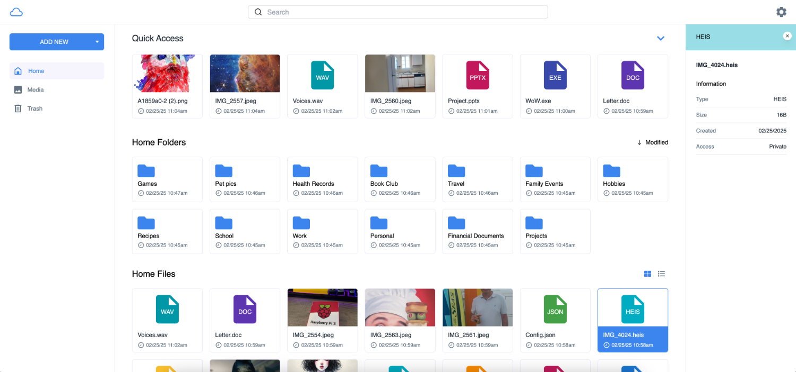

<!--
N.B.: This README was automatically generated by <https://github.com/YunoHost/apps/tree/master/tools/readme_generator>
It shall NOT be edited by hand.
-->

# MyDrive for YunoHost

[](https://ci-apps.yunohost.org/ci/apps/mydrive/)


[](https://install-app.yunohost.org/?app=mydrive)

*[Read this README in other languages.](./ALL_README.md)*

> *This package allows you to install MyDrive quickly and simply on a YunoHost server.*  
> *If you don't have YunoHost, please consult [the guide](https://yunohost.org/install) to learn how to install it.*

## Overview

Open Source cloud file storage server (similar to Google Drive). Host myDrive on your own trusted server or platform, then access myDrive via your web browser. MyDrive uses mongoDB to store file/folder metadata and supports multiple databases to store file chunks, such as Amazon S3 or the File System.


### Caractéristiques

- File upload
- Folder upload (automatic conversion to zip)
- Support for multiple databases (Amazon S3, file system)
- Photo and video viewer and media gallery
- Generated thumbnails of photos and videos
- File sharing
- AES256 encryption
- Mobile support
- Email verification


**Shipped version:** 4.0.2~ynh1

**Demo:** <http://143.244.181.219:3000/>

## Screenshots



## Documentation and resources

- Official app website: <https://mydrive-storage.com/>
- Official admin documentation: <https://mydrive-storage.com/download>
- Upstream app code repository: <https://github.com/subnub/myDrive>
- YunoHost Store: <https://apps.yunohost.org/app/mydrive>
- Report a bug: <https://github.com/YunoHost-Apps/mydrive_ynh/issues>

## Developer info

Please send your pull request to the [`testing` branch](https://github.com/YunoHost-Apps/mydrive_ynh/tree/testing).

To try the `testing` branch, please proceed like that:

```bash
sudo yunohost app install https://github.com/YunoHost-Apps/mydrive_ynh/tree/testing --debug
or
sudo yunohost app upgrade mydrive -u https://github.com/YunoHost-Apps/mydrive_ynh/tree/testing --debug
```

**More info regarding app packaging:** <https://yunohost.org/packaging_apps>
