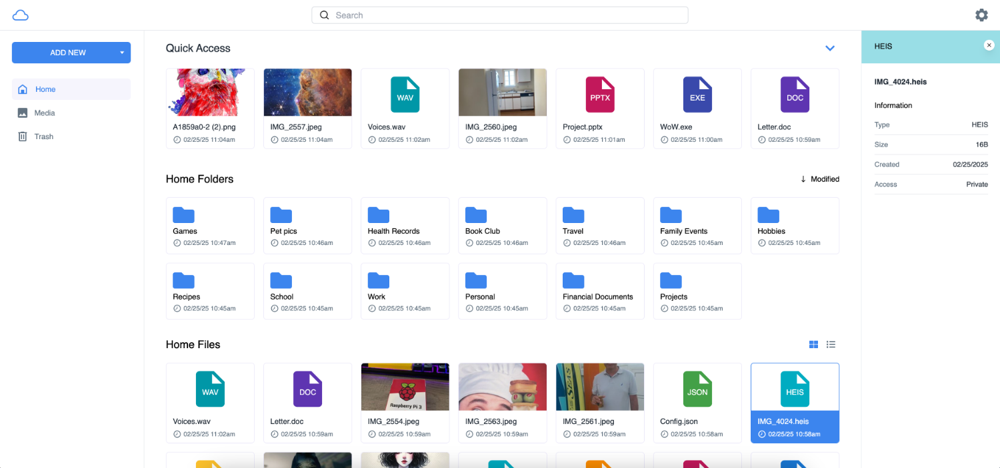

<!--
Nota bene : ce README est automatiquement généré par <https://github.com/YunoHost/apps/tree/master/tools/readme_generator>
Il NE doit PAS être modifié à la main.
-->

# MyDrive pour YunoHost

[](https://ci-apps.yunohost.org/ci/apps/mydrive/)


[](https://install-app.yunohost.org/?app=mydrive)

*[Lire le README dans d'autres langues.](./ALL_README.md)*

> *Ce package vous permet d’installer MyDrive rapidement et simplement sur un serveur YunoHost.*  
> *Si vous n’avez pas YunoHost, consultez [ce guide](https://yunohost.org/install) pour savoir comment l’installer et en profiter.*

## Vue d’ensemble

Serveur de stockage de fichiers en nuage Open Source (similaire à Google Drive). Hébergez myDrive sur votre propre serveur ou plateforme de confiance, puis accédez à myDrive via votre navigateur web. MyDrive utilise mongoDB pour stocker les métadonnées des fichiers/dossiers et prend en charge plusieurs bases de données pour stocker les morceaux de fichiers, comme Amazon S3 ou le système de fichiers.

### Caractéristiques

- Téléchargement de fichiers
- Téléchargement de dossiers (conversion automatique en zip)
- Prise en charge de plusieurs bases de données (Amazon S3, système de fichiers)
- Visionneuse de photos et de vidéos et galerie de médias
- Vignettes de photos et de vidéos générées
- Partage de fichiers
- Chiffrement AES256
- Support mobile
- Vérification des courriels


**Version incluse :** 4.0.2~ynh1

**Démo :** <http://143.244.181.219:3000/>

## Captures d’écran



## Documentations et ressources

- Site officiel de l’app : <https://mydrive-storage.com/>
- Documentation officielle de l’admin : <https://mydrive-storage.com/download>
- Dépôt de code officiel de l’app : <https://github.com/subnub/myDrive>
- YunoHost Store : <https://apps.yunohost.org/app/mydrive>
- Signaler un bug : <https://github.com/YunoHost-Apps/mydrive_ynh/issues>

## Informations pour les développeurs

Merci de faire vos pull request sur la [branche `testing`](https://github.com/YunoHost-Apps/mydrive_ynh/tree/testing).

Pour essayer la branche `testing`, procédez comme suit :

```bash
sudo yunohost app install https://github.com/YunoHost-Apps/mydrive_ynh/tree/testing --debug
ou
sudo yunohost app upgrade mydrive -u https://github.com/YunoHost-Apps/mydrive_ynh/tree/testing --debug
```

**Plus d’infos sur le packaging d’applications :** <https://yunohost.org/packaging_apps>
